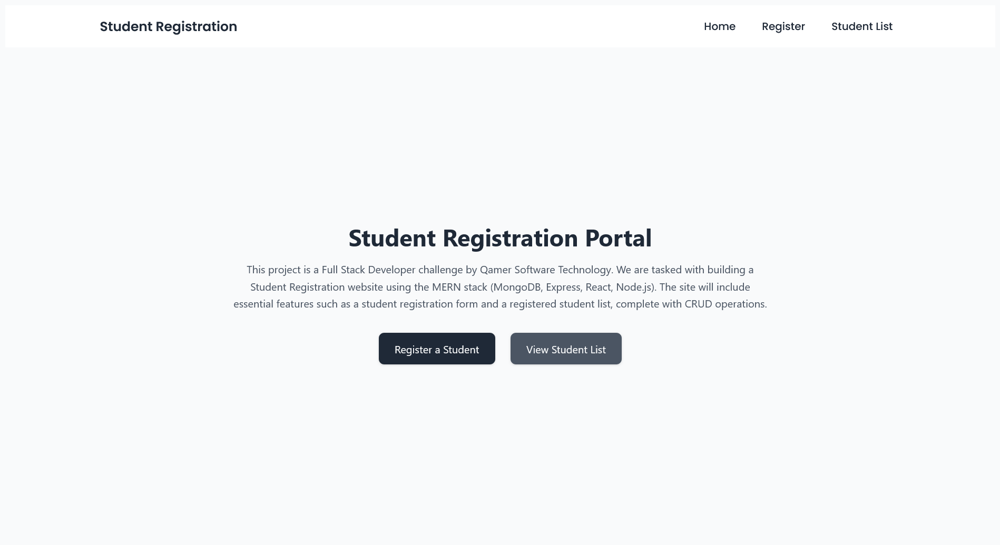
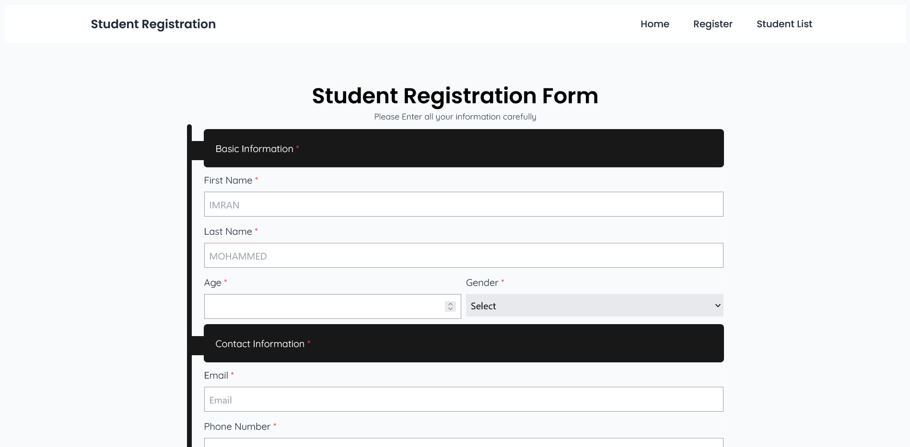
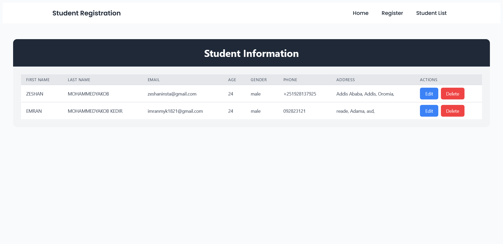
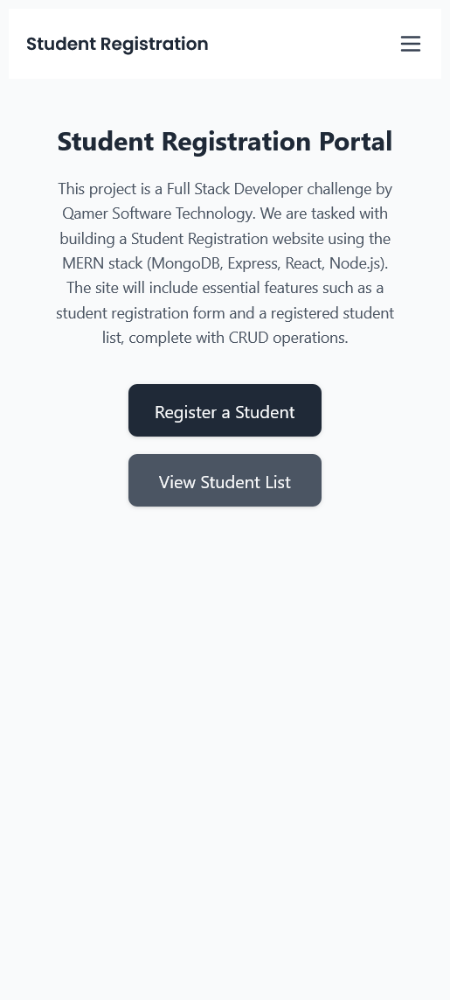
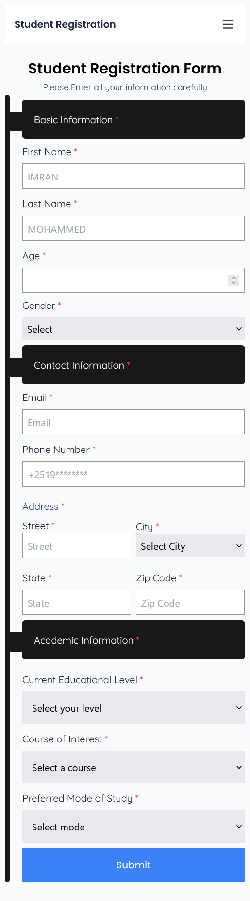
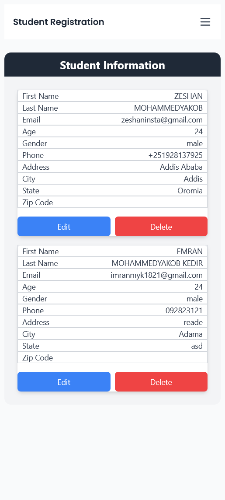

# Student Registration Portal

## Introduction

This project is a **Student Registration Portal** developed as a Full Stack Developer challenge by **Qamer Software Technology**. The goal of the project is to create a user-friendly web application that allows administrators to register new students and manage their details efficiently. The application is built using the **MERN stack**, which includes **MongoDB**, **Express**, **React**, and **Node.js**. 

## Features

- Student Registration Form
- View Registered Student List
- CRUD operations for managing student data

## Technologies Used

- **Frontend**: React
- **Backend**: Node.js and Express
- **Database**: MongoDB

## Screenshots

### 1. Home Page
**Large Screen:**


### 2. Registration Form Page
**Large Screen:**


### 3. Display Registered Students Page
**Large Screen:**



### 1. Home Page
**Mobile Screen:**


### 2. Registration Form Page
**Mobile Screen:**


### 3. Display Registered Students Page
**Mobile Screen:**


## Tasks Completed

- Created a responsive Home Page with navigation.
- Developed a functional Registration Form with validation.
- Implemented a Display Registered Students Page with options for CRUD operations.
- Ensured mobile responsiveness for all pages.

## Installation

1. Clone the repository:
   ```bash
   git clone https://github.com/yourusername/student-registration-portal.git
    ```
2. Navigate to the project directory:
    ```bash
    cd Student-Registration-Form
    ```
3. Navigate to Frontend Directory:
    ```bash
    cd frontend
    ```
4. Install the necessary packages:
    ```bash
    npm install
    ```
4. Start the development server:
    ```bash
    npm run dev
    ```
5. Then open
    ```bash
    localhost:5173 on your browser
    ```